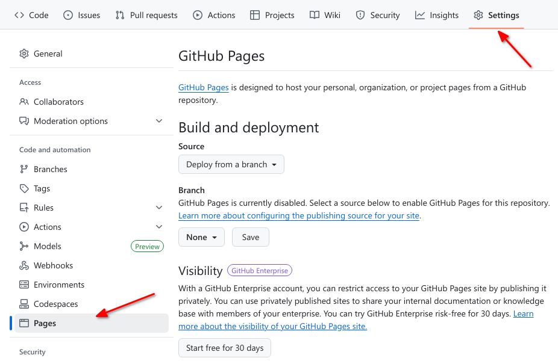

:::::::::::::::::::::::::::::::::::::: questions 

- What is open source?
- What is GitHub Pages?
- How can I use GitHub Pages to collaborate and share my work?

::::::::::::::::::::::::::::::::::::::::::::::::

::::::::::::::::::::::::::::::::::::: objectives

- Create a GitHub repo 
- Complete the steps to make a commit
- Differentiate Markdown and HTML
- Differentiate source and rendered content
- Identify the parts of the GitHub Interface
- Create a Website using GitHub Pages default settings
- Share the link to your webpage with a partner and confirm they can view it
- Consider what options there are to collaborate on a website or contribute to someone else's webpage

::::::::::::::::::::::::::::::::::::::::::::::::

## What is open source
Open source is when a software or a project is published online and available to the public to view the details of or contribute to.

Let's use an example of our own to see what it's like to have an open source project.

## GitHub
GitHub is a developer platform that allows developers to create and hold projects on it. It is benificial for reasons such as managing different versions of a project, collaboration and task management.

### GitHub Interface
:::::::::::::::: instructor

here do a quick over view of the github interface. it changes a lot so screen shots get outdated quickly

::::::::::

There are several key parts to this interface (in a workshop the instructor will point these out):
- name and owner of the project (repo)
- tabs for different content *within* a project (repo): code, issue, PR, ...
- general github things: notifications, profile/settings ...

## GitHub Pages

GitHub Pages is a simple service to publish a website directly on GitHub from a Git repository.
You can add some files and folders to a repository and GitHub Pages turns it into a website.
There are multiple ways of doing so, either by having GitHub use an HTML file (`index.html`) directly to publish, or by using a tool that GitHub provides called Jekyll which renders Markdown into HTML. You can use the contents of one md file directly named either `README.md` or `index.md and Jekyll will render them into a webpage making it really easy to setup a blog or a template-based website.
You can then configure Jekyll with more detailed configuration settings to make your webpage more customized.
There are many tools to convert markdown (or other simple formats, like [RestructuredText](https://docutils.sourceforge.io/rst.html)) to HTML, called [static site generators](https://jamstack.org/generators/).  We will see another one later, called Mystmd (read myst Markdown). 
In this case the markdown is called the *source* and the HTML is the *rendered output*.  One way to think about source is that it is all of the contents you need to get to the output, but in an easier to modify form. The rendered output is what we want to share with our users, here readers, but the source is easier to manage.  The static site generator, combines everything.  This makes it so that content that should appear for example on every page does not need to be repeated.  It also allows us to separate the content from the visual style for the most part. 

These are static sites because other tools, for example wordpress, also separate the content and the style, but they do so dynamically, when a visitor goes to the website, it pulls content from a database, inserts it into the html and then sends it to the visitor's browser. 
### Why GitHub Pages is awesome!

GitHub Pages provides an easy way to publish your material mostly for free with easy means to modify it and format it with a nice theme of your preference. It also comes with all the collaboration and version control features that Git and GitHub provide us with.  
Version control features can be very useful for academic citations. Most people have had the experience of following up a reference to a website and either getting a 404 error or seeing something completely different. Although using versions on your site doesn't guarantee this won't happen, it does make it easier to manage old versions of your site.
More on that later.

## Creating a new repository

A repository can be thought of in many ways, you can think of it as a big folder that holds all the files of your project, or like a vessel that contains all the data and meta-data of your project. Overall a repository is an entity that represents one full project.

To create a new repo login to your GitHub account. At the top, right corner click on the `+` sign and choose `New repository`

{alt="GitHub create a new repo button"}

Give your repository a meaningful name that suits the contents it shall hold. And we encourage adding something to the optional description section. 
Toggle the `Add a README file` button and click on the green `Create Repository` button.

{alt="GitHub create a new repo page"}

Here is a preview of how the new repo would look like:

{alt="GitHub new repo view"}

### Enable GitHub Pages

GitHub Pages is turned off by default for all new repositories, and can be turned on in the settings menu for any repository.

Let's set up a new site by enabling GitHub Pages for our project.

Go to the Pages section of your repository's Settings:

{alt="GitHub repository's Pages settings"}

#### Source branch (required)

Pages needs to know the branch in your repository from which you want to serve your site. This can be any branch, including `main`.

Select then save the source branch:

{alt="GitHub Pages source branch menu"}

{alt="GitHub Pages source branch save"}

#### Theme (optional)

GitHub Pages provides different themes to visually style and organize your site's content. Choosing a theme is optional, and themes can be interchanged quickly.

{alt="GitHub Pages choose theme"}

See the [GitHub Pages documentation](https://docs.github.com/en/pages/getting-started-with-github-pages/adding-a-theme-to-your-github-pages-site-with-the-theme-chooser) for further information on using themes.

### View your site

If we now visit `https://mystudyroom0.github.io/my-website/`,
we should see the contents of the index.md file that created earlier.
Usually it's available instantly, but it can take a few seconds and in the worst case a few minutes if GitHub are very busy.

And here's a preview of the new website

{alt="GitHub new webpage"}

Here, my repository was owned by an GitHub organization (or group) named `mystudyroom0`, hence the name in the link.
The repository is named `my-website`, hence the header of the page.
And the content was what I had typed inside my `README` file which in this case was rendered to be the content of the webpage.

:::::::::::::::::::::::::::::::::::::::  challenge

## Challenge: View your own webpage:
See if you can find the link to your newly generated webpage and share it on eitherpad.
Add the link to your webpage to the about section of your repository.

::::::::::::::: solution

Remember where in the settings we enabled GitHub Pages, the link should be right there. 

To update your repo's about to add the link to your webpage you can find the about section in the right hand side of the main page of your repo.
{alt="GitHub repo about section"}

Click on the gear button and paste the link in the website box.

{alt="GitHub about settings"}

## Adding new content to your webpage

Locally rename a copy of your file to `index.md`

On your repository `code<>` page click `Upload files` from the `Add file` dropdown menu

{alt="GitHub add file"}

Drag your file and drop it in the following page and select `Commit changes`

{alt="GitHub upload file"}

Wait a minute for the new changes to render and then view your website again

{alt="GitHub new webpage with new content"}

:::::::::::::::::::::::::::::::::::::::  challenge

## Challenge: Contributing to a page owned by someone else (slightly easier way)

To practice using Git, GitHub pages and Markdown we can contribute to a GitHub pages site.
Pair up in groups of two (or more if needed) and do the exercises below together.

1. Go to [https://github.com/some-humanist/my-website](https://github.com/some-humanist/my-website), where "some-humanist" is the username of your exercise partner.

2. Click on "Fork" in the upper right part of the screen to create a copy of the repository on your account. Once you have a fork > of your partner's repository, you can edit the files in your own fork directly.

3. Click the "index.md" file, then click the edit pencil icon:
  
  {alt="GitHub edit pencil"}

4. Now is good chance to try some Markdown syntax.
  Try some of the examples at [Mastering Markdown](https://guides.github.com/features/mastering-markdown/).
  You can preview how it will look before you commit changes.

5. Once you are ready to commit, enter a short commit message,
  select "Create a new branch for this commit and start a pull request"
  and press "Propose changes" to avoid commiting directly to the main branch.
  
  {alt="Commit and create pull request"}

6. You can now go to the repository on your account and click "New Pull Request" button,
  where you can select base branches repositories, review the changes and add an additional
  explanation before sending the pull request (this is especially useful
  if you make a single pull request for multiple commits).

7. Your partner should now see a pull request under the "Pull requests" tab
  and can accept ("Merge pull request") the changes there. Try this.

This whole process of making a fork and a pull request might seem a bit cumbersome.
Try to think of why it was needed? And why it's called "pull request"?

:::::::::::::::  solution

## Solution

We made a fork and a pull request because we did not have permission to edit
(or commit) the repository directly. A fork is a copy of the repository that
we *can* edit. By making a pull request we ask the owner of the repository if
they would like to accept (pull in) the changes from our fork (our copy) into
their version. The owner can then review the changes and choose to accept or
reject them.

You can open pull requests on any repository you find on GitHub. If you are a
group of people who plan to collaborate closely, on the other hand,
it's more practical to grant everyone access to commit directly instead.

:::::::::::::::::::::::::

::::::::::::::::::::::::::::::::::::::::::::::::::

> ## Optional challenge: Contributing to a page owned by someone else (slightly more complicated way)
> 
> Instead of making edits on the GitHub website you can 'clone' the fork to your local machine
> and work there.

:::::::::::::::::::::::::::::::::::::::  challenge

Try following the rest of the steps in this guide under ["Time to Submit Your First PR"](https://www.thinkful.com/learn/github-pull-request-tutorial/Writing-a-Good-Commit-Message#Time-to-Submit-Your-First-PR).

(If you followed step 1 and 2 in the previous challenge,
you already have a fork and you can skip the creation of a new fork.
Start instead at the section titled "Cloning a fork."
You can submit multiple pull requests using the same fork.)

::::::::::::::::::::::::::::::::::::::::::::::::::

:::::::::::::::::::::::::::::::::::::::  challenge

## Optional challenge: Adding an HTML page

GitHub Pages is not limited to Markdown. If you know some HTML, try adding an HTML page
to your repository. You could do this on the command line or directly on GitHub. The
steps below are for working directly on GitHub:

1. To add a new file directly on GitHub, press the "Create new file" button.
  
  {alt="Create new file on GitHub"}

2. Name it 'test.html', add some HTML and click "Commit new file".

3. Try opening `https://some-humanist.github.io/hello-world/test`
  (replace "some-humanist" with your username).
  Notice that the HTML extension is not included.

::::::::::::::::::::::::::::::::::::::::::::::::::

::::::::::::::::::::::::::::::::::::: keypoints 

- When editing fils in GitHub.com, we have to commit to save changes
- A commit is a snapshot that we can go back to
- Markup languages use special formatting to label the content and indicate styling in addition to the content in the file, examples include Markdown, ReStructured Text (out of scope), XML, and HTML
- Markdown is a a style of markup that is human and machine readable, it is rendered as HTML
- HTML is the formt of markup that web browsers use
- Source content is what we edit and may content developer information, rendered content (or built) is what is for the reader, output by a build process
- GitHub Pages offer a free host for a website that is rendered from simple text
- Collaboration and version control rules and workflows can be used with GitHub Pages as we shall see in future episodes

::::::::::::::::::::::::::::::::::::::::::::::::