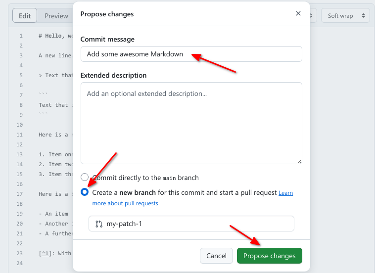

::::::::::::::::::::::::::::::::::::::: objectives

- Make sure the differences between git and GitHub are clear
- Revise some work from day 1

::::::::::::::::::::::::::::::::::::::::::::::::::

## GitHub Pages

:::::::::::::::::::::: callout
GitHub Pages is a simple service to publish a website directly on GitHub from a Git repository.
You add some files and folders to a repository and GitHub Pages turns it into a website.
You can use HTML directly if you like, but they also provide Jekyll,
which renders Markdown into HTML and makes it really easy to setup a blog or a template-based website.
:::::::::::::::::::::::

:::::::::::::::::::::::::::::::: Challenge
### Enable GitHub Pages on the hello-world repo

Remember: GitHub Pages is turned off by default for all new repositories, and can be turned on in the settings menu for any repository.
Let's set up a new site by enabling GitHub Pages for our recently created project.

:::::::::::::::: solution
- On your GitHub view of the hello-world project, go to the settings from the top tab menu
- Find `Pages` on the list on the left
- Change where it says `None` to `main` under `Deploy from a branch
::::::::::::::::
::::::::::::::::::::::::::::::::

:::::::::::::::::::::::::::::::: Challenge
### View your site

Usually it's available instantly, but it can take a few seconds and in the worst case a few minutes if GitHub are very busy.
On the main `code` page of your repo, find the about section and edit it to include the link to your webpage and try opeinging the link\
Share the link on Eitherpad
:::::::::::::::: solution
Check the box that says `Use your GitHub Pages website`

::::::::::::::::
::::::::::::::::::::::::::::::::

:::::::::::::::::::::::::::::::: Challenge
### Clone your "my-website" locally and explore its content 

Today we created a repo (project) locally (on our terminal) and then created an online duplicate of it, then we linked them to each other to be able to "push" and "pull" changes. Basically saving our work on a cloud.

Now, let's do it the other way around. We created a project online on day 1 called my-website. Let's now create a local copy of this project to ourselves to be able to make changes to that project locally.

Use this [instructional page](https://docs.github.com/en/repositories/creating-and-managing-repositories/cloning-a-repository) to read about how to do so

:::::::::::::::: solution
- On your terminal `cd` into a folder where you want to have the local copy of your repo
- run the command `git clone <link_to_project>`
- Confirm this was successful with `ls`
- Check the contents of the newly added project folder using `cd`, `ls` and `cat`
::::::::::::::::

:::::::::::::::::::::::::::::::::::::::  challenge

## Challenge: Contributing to a page owned by someone else (slightly easier way)

To practice using Git, GitHub pages and Markdown we can contribute to a GitHub pages site.
Pair up in groups of two (or more if needed) and do the exercises below together.

1. Go to [https://github.com/some-librarian/hello-world](https://github.com/some-librarian/hello-world), where "some-librarian" is the username of your exercise partner.

2. Click on "Fork" in the upper right part of the screen to create a copy of the repository on your account. Once you have a fork > of your partner's repository, you can edit the files in your own fork directly.

3. Click the "index.md" file, then click the edit pencil icon:
  
  {alt="GitHub edit pencil"}

4. Now is good chance to try some Markdown syntax.
  Try some of the examples at [Mastering Markdown](https://guides.github.com/features/mastering-markdown/).
  You can preview how it will look before you commit changes.

5. Once you are ready to commit, enter a short commit message,
  select "Create a new branch for this commit and start a pull request"
  and press "Propose changes" to avoid commiting directly to the main branch.
  
  {alt="Commit and create pull request"}

6. You can now go to the repository on your account and click "New Pull Request" button,
  where you can select base branches repositories, review the changes and add an additional
  explanation before sending the pull request (this is especially useful
  if you make a single pull request for multiple commits).

7. Your partner should now see a pull request under the "Pull requests" tab
  and can accept ("Merge pull request") the changes there. Try this.

This whole process of making a fork and a pull request might seem a bit cumbersome.
Try to think of why it was needed? And why it's called "pull request"?

::::::::::::::::::::::::::::::::::::::::::::::::::

> ## Optional challenge: Contributing to a page owned by someone else (slightly more complicated way)
> 
> Instead of making edits on the GitHub website you can 'clone' the fork to your local machine
> and work there.

:::::::::::::::::::::::::::::::::::::::  challenge

Try following the rest of the steps in this guide under ["Time to Submit Your First PR"](https://www.thinkful.com/learn/github-pull-request-tutorial/Writing-a-Good-Commit-Message#Time-to-Submit-Your-First-PR).

(If you followed step 1 and 2 in the previous challenge,
you already have a fork and you can skip the creation of a new fork.
Start instead at the section titled "Cloning a fork."
You can submit multiple pull requests using the same fork.)

::::::::::::::::::::::::::::::::::::::::::::::::::

:::::::::::::::::::::::::::::::::::::::: keypoints

::::::::::::::::::::::::::::::::::::::::::::::::::

