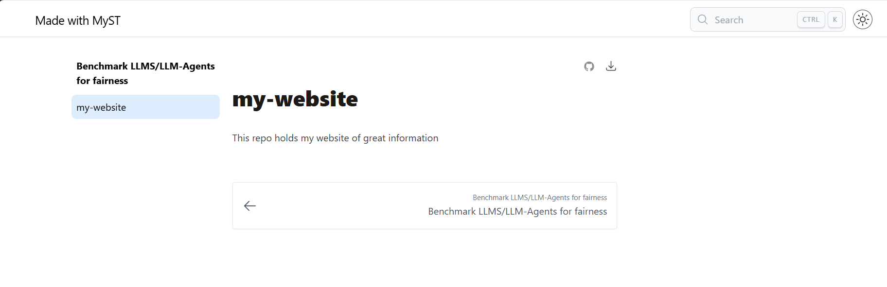
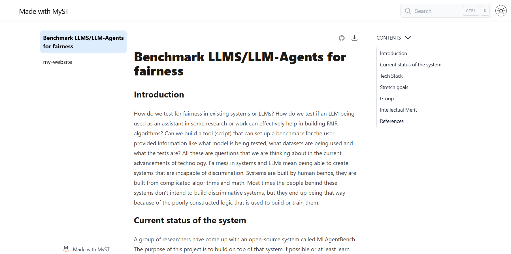
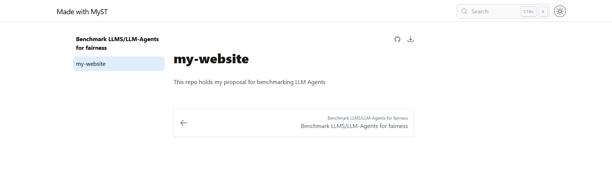
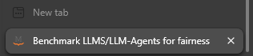
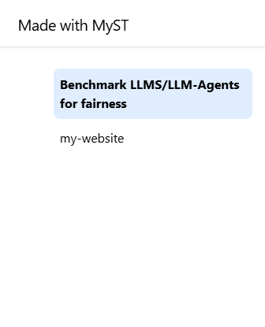
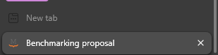
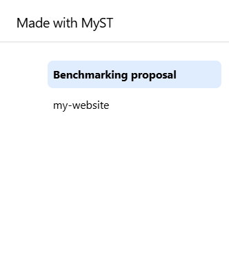

:::::::::::::::::::::::::::::::::::::: questions 

- How can we build an interactive webpage using Markdown files?
- How do we initialize myst?
- What does myst need to run?
- How do I view my work?

::::::::::::::::::::::::::::::::::::::::::::::::

::::::::::::::::::::::::::::::::::::: objectives

- Explain what myst is and its benafits
- Run myst for the first time
- Check myst requirments
- View the webpage we built locally 

::::::::::::::::::::::::::::::::::::::::::::::::

:::::::: instructor

Remember to address feedback from the previous session

::::::::::::::::::::::::::::::::::::::::::::::::::


:::::::: instructor

Today is when everything we've learned comes together.
- We've talked about GitHub
- We've seen GitHub pages convert markdown to HTML
- We got introduced to the shell of our operating systems
- And we've learned how to manipulate files and data in the shell

::::::::::::::::::::::::::::::::::::::::::::::::::


## Introduction

MyST is an open-source, community-driven project to improve scientific communication, including integrations into Jupyter Notebooks and computational results. (Sourced from [mystmd.org's Project goals](https://mystmd.org/guide#project-goals))

Myst is a tool that we will learn to use to build interactive webpages or pdfs. The benifit of this is more powerful publishing of content and information.


Here's an example of a paper published using myst: [A Literature Review On AI fairness Best Practices](https://ml4sts.com/fairml-bestpractices/)


<!-- here is a good place for a testimonial box with past learners' sites -->


::::::::::::: instructor
Show dynamic glossary items and links
- Header
- Tables of contents 
- AI in intro vs AI in Technical challenges
- Links to articles
- Table in Fair-learn
- Table in Synthesis of Frameworks
::::::::::::::::::::::::::::::::::::::::::

## A Different Way of Building HTML
The purpose of MyST is to have a powerful tool that builds interactive HTML pages without doing any HTML coding.
Remember, on the first day we used GH Pages' simple rendering system to render a single md file (`index.md`) into a simple HTML page.
MyST can also do this, except that it uses templates to render pages with a more structure, does some extra processing of the content and it can render a collection of md files distributed across multiple directories within one project directory into a cohesive site.


Let's learn about using myst on the simple repo we created on the first day.

## Starting myst
Open your terminal and navigte to your `my-website` repo's directory:

```bash
cd Desktop/my-website
```

Type the command `code` into your terminal 

```bash
code .
```

:::::::: instructor
Quick rundown on vscode view. 
If code doesn't work (problems with path) open vscode manually
Instructions for macos are linked on setup page
::::::::::::::::::::::::::::::::::::::::::::::::::


Notice how you can access your terminal directly from vscode too!


In your terminal type myst:
```bash
myst init
```

This will produce output like: 
```
Welcome to the MyST CLI! 🎉 🚀

myst init walks you through creating a myst.yml file.

You can use MyST to:

 - create interactive websites from markdown and Jupyter Notebooks 📈
 - build & export professional PDFs and Word documents 📄

Learn more about this CLI and MyST Markdown at: https://mystmd.org


✅ Project already initialized with config file: myst.yml
✅ Site already initialized with config file: myst.yml

? Would you like to run myst start now? 
```

Answer the prompt with `yes`

```
? Would you like to run myst start now? Yes
```

answer with Yes again

```
📖 Built README.md in 62 ms.
📖 Built index.md in 364 ms.
📚 Built 2 pages for project in 482 ms.


        ✨✨✨  Starting Book Theme  ✨✨✨


🔌 Server started on port 3000!  🥳 🎉


        👉  http://localhost:3000  👈


```

This tells you that all the files that were in your directory (README.md & index.md) were built into a website locally.

::::: callout
Locally means this content is hosted on your machine. Not published for the public to be able to access.
:::::


To view this website follow the link provided in the prompt:
`http://localhost:3000`


::::: callout
If your port `3000` was already occupied you might get a different number e.g. 3001 or 3002
:::::


### What did this do?
Firstly we notice that the files in the directory increased.

- the first new file is called `myst.yml` as mentioned by the output from the command we ran.
- another is `.gitignore`
- there is also a new folder `_build/`

If we opened the webpage using the link above we see somthing like this

{alt="my-website rendered locally"}
{alt="my-websit's other page rendered locally"}

We notice a few things on this page:  
- On the top-left corner says `Made with Myst`
- For each md file we have a button on the left page section 
- On the top-right corner we have a dark/light theme button as well as a search bar that works!


::::::::::::::::::::::::::::::::::::: challenge 

## Edit your readme file and see what happens


:::::::::::::::::::::::: solution 

## Output
 
We notice how myst tracks all requests on the local host and applies the changes made to the readme file immedietly to the webpage
```output
💌 GET  /readme?_data=routes%2F%24 200 - - 9.687 ms
📖 Built README.md in 57 ms.
💌 GET  /readme 200 - - 18.691 ms
```

{alt="my-website rendered locally with new readme"}

:::::::::::::::::::::::::::::::::
::::::::::::::::::::::::::::::::::::::::::::::::


#### What does that tell us?
We were able to create an interactive webpage using the same markdown files and turn them into an interactive page. We used the `myst` tool to make the webpage look nicer and have more powers.

We also notice that with every change we make the contents of the `_build` folder get **rebuilt** to generate the newly updated material and settings. And we see a large number of files in there that we might want to hide from the front face of our GitHub repo.

Myst planned ahead and automatically added a `.gitignore` file and added patterns (like the ones we used on the shell with the bash commands) for those files.  Take a look to see.


#### What did myst need to run?
We noticed earlier that myst added a file to our directory as soon as we ran it. `myst.yml`
Let's figure out why it did so by viewing the contents of it and trying to understand it.

``` bash
cat myst.yml
```
or view it using vscode


```yaml
# See docs at: https://mystmd.org/guide/frontmatter
version: 1
project:
  id: 5f256b79-5f82-4a71-b061-138da64f191a
  # title:
  # description:
  # keywords: []
  # authors: []
  github: https://github.com/mystudyroom0/my-website
  # To autogenerate a Table of Contents, run "myst init --write-toc"
site:
  template: book-theme
  # options:
  #   favicon: favicon.ico
  #   logo: site_logo.png
  ```


We find that the the file holds some metadata for the webpage. Most of it isn't filled in and is also commented out since it isn't filled out yet. (we comment lines in the YAML syntax using the `#` symbol). We also some site settings such as the theme, logo and icon.
So we learn that myst requires this file to be in your project directory to be able to built the webpage.


::::::::::::::::::::::::::::::::::::: challenge 

## Editing meta data
Change the title of your webpage from the `myst.yml` file and observe the difference before and after

:::::::::::::::::::::::: solution 

Let's look at how the tab is labeled on the browser and what the page title looks like 

{alt="my-website rendered locally with old tab title"}
{alt="my-website rendered locally with old title"}

Edit the metadata of your webpage from ` myst.yml`. Remove the `#` to uncomment the line that has `title:` in it and then add a title to your webpage.

```yaml
# See docs at: https://mystmd.org/guide/frontmatter
version: 1
project:
  id: b9be35e6-0f75-4da5-b971-9add4d00ed44
  title: Benchmarking proposal
  # description:
  # keywords: []
  # authors: []
  github: https://github.com/some-humanist/my-website
  # To autogenerate a Table of Contents, run "myst init --write-toc"
site:
  template: book-theme
  # options:
  #   favicon: favicon.ico
  #   logo: site_logo.png
```

{alt="my-website rendered locally with new lab title"}
{alt="my-website rendered locally with new title"}

:::::::::::::::::::::::::::::::::
::::::::::::::::::::::::::::::::::::::::::::::::

::::::::::::::::::::::::::::::::::::: keypoints 

- Myst is a tool that builds interactive webpages from markdown files 
- To built a webpage using myst we simply start myst on the terminal
- Myst requires the file `myst.md` to run and build a webpage

::::::::::::::::::::::::::::::::::::::::::::::::

 
